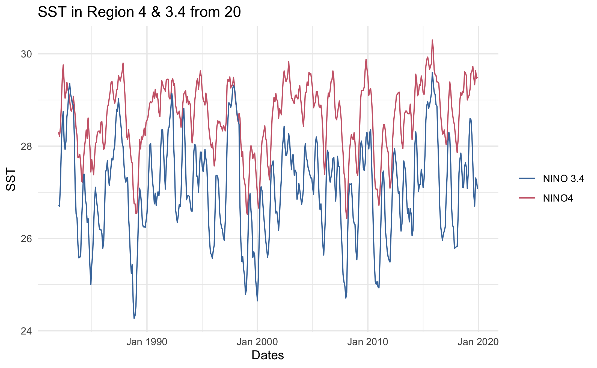

```{r setup, include=FALSE}
knitr::opts_chunk$set(echo = TRUE)

```

This file houses the supplementary material not included in the final manuscript. 

## Exploratory Data Analysis

### Weather Predictors

```{r EDAfig1,  fig.cap='EDAfig1.', echo=FALSE}

```

```{r EDAfig2,  fig.cap='EDAfig2.', echo=FALSE}
knitr::include_graphics("../results/exploratoryfigures/EDAfig2.png")
```


Here is a summarizing table that looks at weather by season. Here you can note the seasonality in the data and the general trend. This figure accompanies the cumulative dengue incidence by season. 
```{r EDAfig10,  fig.cap='EDAfig10.', echo=FALSE}
knitr::include_graphics("../results/exploratoryfigures/EDAfig10.png")
```
### Dengue Distribution

### Bivariate Interaction between Dengue Distribution and Weather Predictors

This graph is looking at dengue IR and the average temperature. 
```{r EDAfig8,  fig.cap='EDAfig8.', echo=FALSE}
knitr::include_graphics("../results/exploratoryfigures/EDAfig8.png")
```
This graph is looking at dengue IR and precipitation. Similar relationship to the above. This may be because the lag period is not accounted for. 
```{r EDAfig9,  fig.cap='EDAfig9.', echo=FALSE}
knitr::include_graphics("../results/exploratoryfigures/EDAfig9.png")
```


# Modeling Figures and Rationale
The figue represent all the data compared on a time series format.
```{r A1P2.png,  fig.cap='A1P2', echo=FALSE}
knitr::include_graphics("../results/analysisfigures/A1P2.png")
```

The following two figures are checking to see if data is normally distributed in both histogram form and QQ plot form
```{r A1P3.png,  fig.cap='A1P3', echo=FALSE}

```

```{r A1P4.png,  fig.cap='A1P4', echo=FALSE}
knitr::include_graphics("../results/analysisfigures/A1P4.png")
```


### Multiple Linear Regression with PCA
Below are the two Principal Component Analysis figues produced. 
```{r A1Ml.P1.png,  fig.cap='A1Ml.P1', echo=FALSE}
knitr::include_graphics("../results/analysisfigures/A1Ml.P1.png")
```

```{r A1Ml.P2.png,  fig.cap='A1Ml.P2', echo=FALSE}
knitr::include_graphics("../results/analysisfigures/A1Ml.P2.png")
```
Looks like PCA1 has to do mainly with population, not sure why it popped up. PCA 2-5 look the most interesting. Based on ENSO value, it looks like PCA2 and PCA3 describe "normal" weather phases, or neither El Nino or La Nina classified as 0 ENSO. PCA4 appears Cooler phases or La Nina cycle, and PCA5 seems to describe El Nino, however Precipitation is not very representative of this. 


### Poission Regression

Residual plot for Poission Regression
```{r A1PR.P1.png,  fig.cap='A1PR.P1', echo=FALSE}

```

### Decision Tree
RMSE plot for Decision TreeS
```{r MLDT.png,  fig.cap='MLDT', echo=FALSE}

```


### K Nearest Neighbors Model
RMSE plot for  K Nearest Neighbors Model
```{r MLKN.png,  fig.cap='MLKN', echo=FALSE}

```

### K Nearest Neighbors Model
RMSE plot for fINAL model:Poisson Regression
```{r MLFIN.png,  fig.cap='MLFIN', echo=FALSE}

```


Null  Model | 100.3227	
Multi Linear Regression Model | 93.03668	
Poisson Regression | 77.94448	
Negative binomial regression | 101
Decision Trees | 98.81927
LASSO | 113.3661	
K Nearest Neighbors Model | 77.7879416


