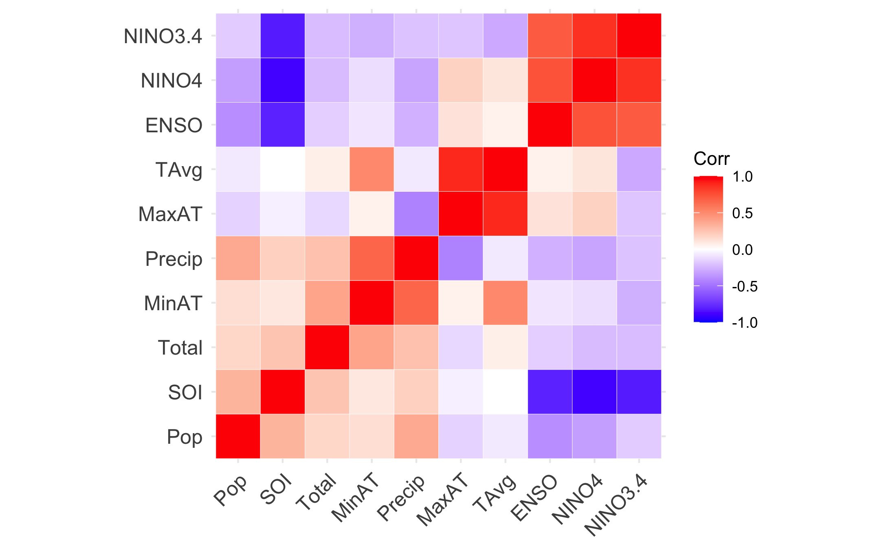

# Background

Since the start of the 20th century, dengue fever and dengue hemorrhagic fever have caused a significant burden in many parts of the world. According to the WHO, dengue incidence has increased 30-fold in the past 50 years [@who2012global]. Environmental impacts on the breeding patterns and overall population of dengue's primary host, the aedes Aegypti mosquito can be the suspected cause of this increase incidence. Factors such as rapid urbanization, change in weather and conditions, and poor sanitation contribute to the population growth of such Aedes vectors [@medlock2015effect].
Dengue has 4 main serotypes, all of which have been found to circulate in South America. The country of Peru has experienced intermittent dengue outbreaks, some lasting as log as 10 years[@stoddard2014long].It is also important to note that aedes Aegypti can also carry other arboviral diseases such as Zika, Chikungunya and West Nile, all of which are endemic to Peru to a smaller porportion. The city of Iquitos is conveniently located in close proximity to Nanay, Itaya, and Amazon Rivers and has a detailed dengue surveillance program set up with the Peruvian Ministry of Health and the U.S. Naval Medical Research Unit[@stoddard2014long]. Iquitos proximity to the ocean and higher altitude make this city ideal to study large scale weather phenomena on an urban level.
The El Niño Southern Oscillation (ENSO) cycle has been shown to impact climate and ecology around the world. Its effect on infectious diseases transmission across South America has only been studied as isolated incidences or as general patterns on a limited geographic span. Climate data is important factor when studying zoonotic diseases and their geographic range[@tantalean2016arboviruses]. Waterborne and vector borne diseases usually see a spike in incidence rates when the host specie’s life cycle, habitat or breeding habits are altered, for this paper the Aedes aegypti mosquito host will be studied. The Aedes aegypti mosquito is the carrier of diseases found in south America such as dengue, Zika, West Nile virus, Chikungunya, and Venezuelan equine encephalitis (VEE) [@tantalean2016arboviruses, @vincenti2018enso]. Dengue is the most prevalent arboviral disease in south America [@vincenti2018enso]

The impact of temperature and weather patterns has been shown to affect aedes Aegypti habitat and population dynamics. While as of 2021, dengue is mainly found in tropical and subtropical regions, studies have predicted that by 2050 southern United States and coastal eastern China and Japan will be at risk of endemic dengue transmission due to global climate change [@messina2019current].

### ENSO and Vector Population
Other countries such as India and Australia have been able to create predictive models, showing that a change in mean SOI values and rainfall variables are associated with either an increase or decrease of dengue incidence 3 months later [@earnest2012meteorological,@hu2010dengue].

Dengue is a zoonotic disease and relies on vector dynamics, so it is important to understand the timeline between weather events and the increase or decrease in cases. This "lag" between climate data and disease incidence differs depending on region, weather and dominant mosquito. Lower temperatures result in shorter "lag" times due to mosquito’s mortality. The inverse can be seen with higher temperatures and humidity, having longer lag times due to favorable breeding conditions [@gharbi2011time]. Such a lag time has been measured to be anywhere form 4 to 18 weeks [@brunkard2008assessing].

Studies done in South America have also concluded similar lag times for weather anomalies and dengue prediction, and have ranged anywhere from 1 month to 5 months depending on season and variable [@vincenti2018enso, @stewart2013climate]. Since the ENSO cycle, both El Nina and La Nina, can affect this lag time differently  based on the 1-3 year cycles, no firm number has been found to be associated with ENSO related predictors, as discussed in greater detail in a recent paper by Dr.Stewart-Ibarra [@stewart2013climate].


# Description of data and data source
## NOAA Data
El Niño and La Niña weather phenomena is measured as a function of the Southern Oscillation Index (SOI) and Sea Surface Temperature (SST). Both negative and positive SOI & SST values coincide abnormally warm and ocean waters across the eastern tropical & southern Pacific as well as change in air pressure. Other measures of outcomes of El Niño and La Niña episodes are ocean salinity, ocean temperature, ambient temperature, rainfall. SOI, SST and ENSO data for the years of 2001-2009 is publicly available and obtained from the National Oceanic and Atmospheric Administration (NOAA)

Our primary region of interest is 3.4, however in some cases data from region 4 is a better indicator for landfall values. For this reason, some variables will have both region 3.4 and 4 as predictors. If data from region 4 is used, it will be noted. 

!(nino-regions.gif)

## Dengue Forecasting Project Data
Weekly dengue reported cases from 2001-2009 in Iquitos, Peru is obtained from the Dengue Forecasting Project partnership with CDC and NOAA. Since dengue incidence data was reported from serological tests, serotype(DENV1-4) is included. This publicly available dataset also includes yearly population and monthly average rainfall data as well.

## Questions/Hypotheses to be addressed
With the data I have chosen, I am looking to see if the El Niño and La Niña weather phenomena can be used as a predictor of arboviral disease transmission, specifically dengue in Iquitos, Peru. 


# Methods and Results

## Data import and cleaning
Data cleaning consisted of combining all NOAA data sets into one larger set. This was done by converting all dates into numerical forms across each platform as well as adding additional week numbers. It's important to note that the dengue data sets count incidents both weekly and by the physical date. This season in which the weeks are counted are not done by traditional year (starting in Janurary) but by Peruvian dengue seasons, starting in May. For this reason I chose to join all data sets using the physical date at the beginning of each week (month-day-year). Each data set was trimmed to match the original range of the dengue data set given.


## Exploratory analysis
Initial exploratory data analysis was done on individual data sets after cleaning. Once sets were merged, addition descriptive table and models were produced. 
With the exploratory date analysis, one of the main goals when looking at the ecological data was to understand the interaction between the NOAA variables, SOI, SST and ENSO classification. This is done in the following chart. 
As mentioned previously both region 4 and 3.4 included in the data set because both are deemed as appropriate indicators of SST for the coastal Atlantic region. Each differ slightly but both are used for predicting patterns on the South American Coast (cite source)

SOI values follow do not follow an obvious pattern of either region 4 and 3.4 SST value as pictured in  Figure \@ref(fig:EDAfig3)
```{r EDAfig3,  fig.cap='EDAfig3.', echo=FALSE}
knitr::include_graphics("../../results/exploratoryfigures/EDAfig3.png")
```

Figure \@ref(fig:EDAfig4) is a visualization of El Niño and La Niña occurrences. ENSO values coded red are El Niño and values coded blue are La Niña. These are the official classifications done by NOAA using various climate indicies and are not as sensitive of an indicator.
```{r EDAfig4,  fig.cap='EDAfig4.', echo=FALSE}
knitr::include_graphics("../../results/exploratoryfigures/EDAfig4.png")
```

Dengue incidence in Iquitos Peru is represented in the following 3 graphs. Since all cases are reported via laboratory testing, serotyping can be done. Figure
 \@ref(fig:EDAfig6) show this distribution. Note the introduction of DENV-4 around 2008. 
```{r EDAfig6,  fig.cap='EDAfig6', echo=FALSE}
knitr::include_graphics("../../results/exploratoryfigures/EDAfig6.png")
```
This table \@ref(tab:Table1) summarized the data above.
```{r Table1,  echo=FALSE}
resulttable=readRDS("../../results/exploratoryfigures/Table1.rds")
knitr::kable(resulttable, caption = 'Table1.RDS.')
```

Cumulative incidence of reported dengue infection by year is shown in the following graph.
Figure \@ref(fig:EDAfig7)
```{r EDAfig7,  fig.cap='EDAfig7', echo=FALSE}
knitr::include_graphics("../../results/exploratoryfigures/EDAfig7.png")
```

## Full analysis
The goal of this analysis is to create and fit non-time series models from quarterly averaged data. Quarterly averaging was done to account for the variable lag period between ENSO related weather events and the increases or decreases in dengue incidence. This variable lag period can be anywhere between 3-6 weeks, with warmer temperatures correlated with shorter lag periods and vice versa as mentioned in introduction @vincenti2018enso, @stewart2013climate. This quarterly averaging will result in fewer data points and thus a weaker model, but was done for the sake of producing models within the scope that the MADA class has covered. This new quarterly averaged set answers weather or not monthly ENSO related weather variables predict monthly dengue case load.

Before any models were implemented, an analysis of covariance was done on predictor variables. Below are the results in a heatmap form. 
```{r A1P1.png,  fig.cap='EDAfig7', echo=FALSE}

```


In General, ENSO and SST (3.4 & 4) all had signs of covariance. This was expected as SST and SOI are all included in ENSO classification. For simple regressions, an SST location (3.4 or 4) will be chosen to be the best predictor. Both min and max air temperature interacted with average air temperature. Average air temperature was omitted for non variable selection models.

Data was split into testing and training sets, with training data used to fit the 2000/2001- 2008/2009 season and testing set used to evaluate the 2009/2010-2012/2013 season. Data set was small (52 observations), but cross validation was chosen to ensure proper performance, ultimately accepting wider confidence intervals. Leave One Out (LOO) cross validation strategy was not used. While it is ideal for smaller datasets, the time series nature would not allow for enough variability in the training set to adequately predict dengue case numbers. 

The primary outcome was monthly dengue case count, and used population adn various weather predictor variables such as Air Temp, Precipitation, ENSO, SOI and SST. A Multiple Linear Regression Model, Poisson Regression, Decision Trees, LASSO and K Nearest Forest Model were all done using the Tidymodels package in R. Negative binomial regression was done using the MASS package in R. Root Mean Square Error was used to compare models to null model. See the chart below for RMSE values of all models.

The Multi Linear Regression Model was fitted with principal component analysis to address the multi-colinearity that exists between the variables. While no official clusters were picked up, 2 principal components described what was interpreted to be some variation of ENSO values. For the Negative Binomial Regression, the model with Population, Precipitation, min/max air temperature and SOI value performed the best. The LASSO model performed similarly, choosing the same variables as well as ENSO classification. On the contrary, the Decision Trees model only ended up choosing min and max air temperature for final variables. The K Nearest Neighbors Model was chosen for its accurate performace with smaller data sets and was the best performing model,however did not perform as well on folded data set. The coefficent *k* was chosen as 6 to avoid any overfitting. 


Model | RMSE
------------- | -------------
Null  Model | 100.3227	
Multi Linear Regression Model | 93.03668	
Poisson Regression | 77.94448	
Negative binomial regression | 101
Decision Trees | 98.81927
LASSO | 113.3661	
K Nearest Neighbors Model | 77.7879416	

## Final Model
Ultimately the Poisson Regression model was chosen for its simplicity. Below are the final fitted results on test data. For more detail on model fitting, see the supplemental file. The final RMSE was 23.20935.
```{r A1P2.png,  fig.cap='EDAfig7', echo=FALSE}
knitr::include_graphics("../../results/analysisfigures/A1P2.png")
```


# Discussion

Ultimately the greatest weakness was the smaller sample size within the data. A more complex auto regressive model would have been able capture the variable and seasonal lag periods between variables. 


# References


